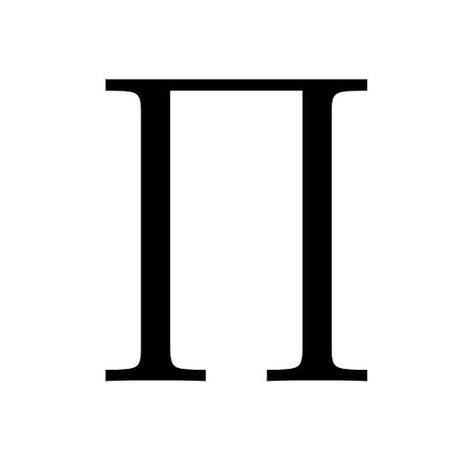

<div align="center">
  
  <br>
  
  
</div>

## Overview

Note: It would be preferred if you do not host your own instance of this bot

### Table of contents
- [Getting Started](#getting-started)
- [Commands](#commands)
- [License](#license)

## Getting Started

### Python venv

Make a virtual environment

```shell
$ mkdir bot && cd bot
$ python -m venv venv
$ source venv/bin/activate
```

Clone the repo

```shell
$ git clone https://github.com/yak-fumblepack/pi.git
$ cd pi
$ pip install -U -r requirements.txt
```

Add your token to the environmental variable file (`.env`). Make sure you are in the project's root directory.

```shell
$ touch .env && echo "token=<your token without spaces and without the arrow brackets>" >> .env
```

Change directory and run the bot.

```shell
$ cd bot/src/
$ python main.py
```

Have fun!

### Docker

Prerequisites:
- Docker
- Docker Compose

To run both the bot and the flask backend:

```shell
$ sudo docker pull yakfumblepack/pi
$ sudo docker-compose up --build
```

Running them individually:

```shell
$ sudo docker-compose up --build pi-bot
```

```shell
$ sudo docker-compose up --build pi-site
```

To run them invididually using separate images, refer to their respective readmes:
- [The bot](https://github.com/yak-fumblepack/pi/tree/rewrite/bot)
- [The flask backend]()

## Commands

Coming soon.

## License
This project is licensed under the [GNU AGPL-3.0](https://www.gnu.org/licenses/agpl-3.0.txt) license.